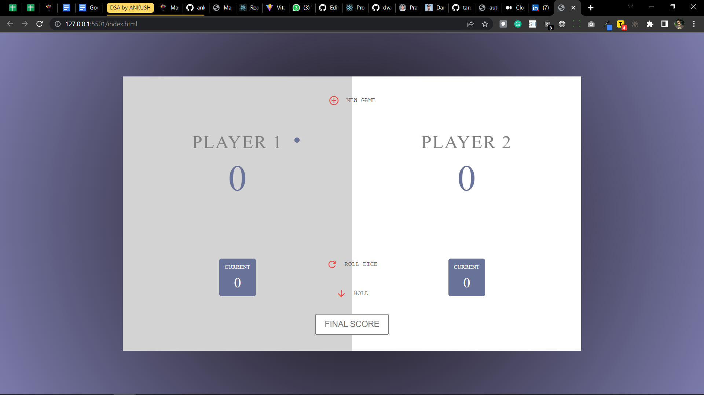
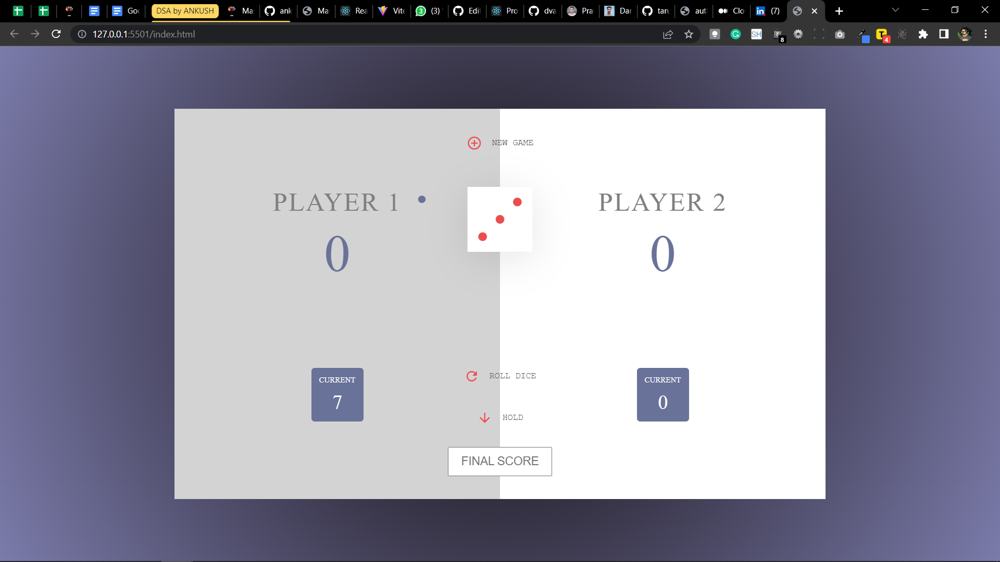
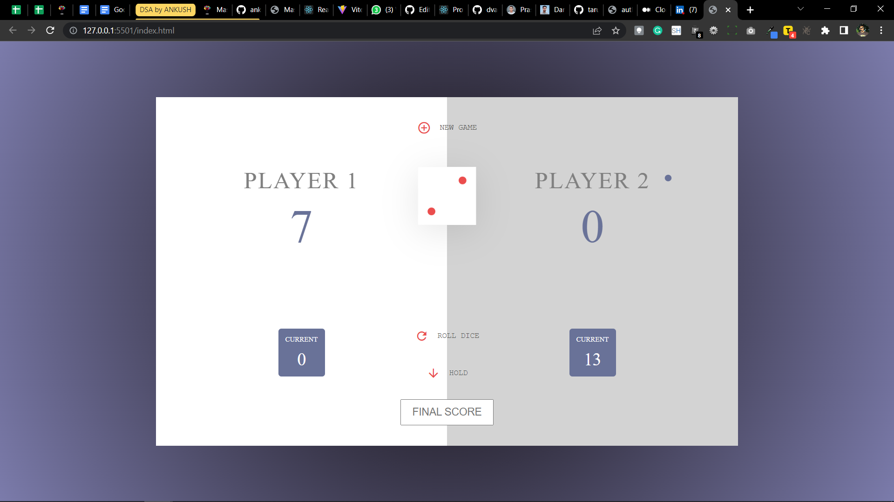

# Dice Game

- **Dice It** is a 2 player game with following rules:
  - A player continues to roll the dice until he decides to hold or he scores **1**.
  - While the player rolls dice everytime, the total score for current round increments with dice value.
  - If scored 1 , the player not only get switched. But the round score for the 1 scoring player is considered 0. To avoid such scenario, a player can hold to save the current round score.
  - The first player to reach a score of 100 wins the match
- The app is developed in HTML, CSS & Javascript. Bootstrap is used as a framework for CSS.

[Deploy link](dicegameswitch.netlify.app/)

## Tech Stack:

   
   
   
   

## Features:

1. Dice roll from 1 to 6 using Document object model.
2. keep adding Dice value according to Player
3. Reset total when dice show 1.
4. Player reaches t0 100 will win the game.

<h1>Snapshots of our project</h1>

1. Page showing has not been started

2. page showing player_1 turn

3. page showing player_1 turn

